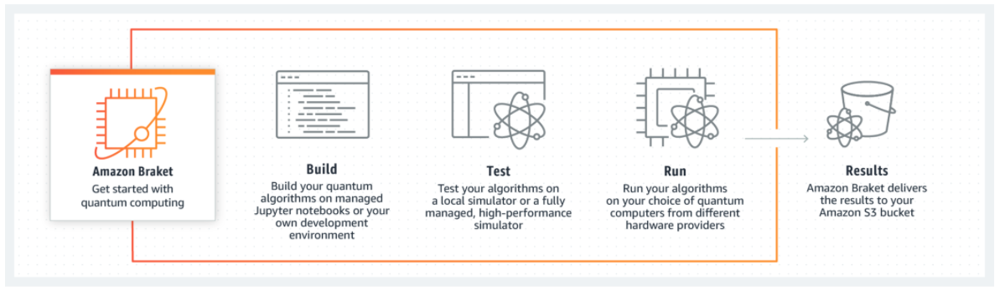

# Amazon Braket Workshops
This workshop explains how to use **Amazon Braket** service. From enabling the service to running the quantum algorithm, you can experience the all contents.
Thanks to the **Amazon Braket Sepcialist SA Team (Pavel & Tyler)**, you can run interesting quantum algorithm codes with various QPU devices including quantum annealers from **D-Wave**, and gate-based computers from **Rigetti** and **IonQ**. 

Get started: http://aws-ps-kr-workshop.s3-website-us-east-1.amazonaws.com/braket-workshop/

! This workshop is written in **Korean**.

## Amazon Braket
[Amazon Braket](https://aws.amazon.com/braket/) is a fully managed quantum computing service that helps researchers and developers get started with the technology to accelerate research and discovery. Amazon Braket provides a development environment for you to explore and build quantum algorithms, test them on quantum circuit simulators, and run them on different quantum hardware technologies.

