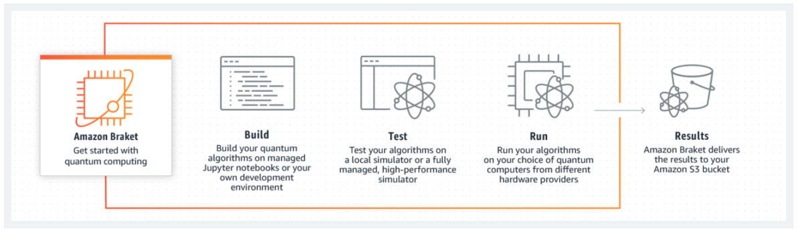

# AMAZON BRAKET HANDS ON LAB

---

## Amazon Braket 소개
Amazon Braket은 완전 관리식 양자 컴퓨팅 서비스로, 양자 알고리즘을 탐색 및 구축하고 양자 회로 시뮬레이터에서 테스트하며 다양한 양자 컴퓨팅 하드웨어 기술에서 실행할 수 있는 개발 환경을 제공합니다.

---
## 실습 개요 및 순서
본 실습에서는 AWS 양자컴퓨팅 기술의 전반적인 개념을 소개하는 이론 세션, AWS 클라우드 상에서 양자컴퓨팅 활용 방법을 안내하는 데모 세션, **Braket을 직접 사용해보는 Hands-on Lab 세션**으로 구성되어 있습니다.

실습은 아래와 같이 진행되며 약 1시간 정도 소요됩니다.

1. [사전 준비사항](prerequisite)
2. [Amazon Braket 콘솔 접속](braket)
3. [Jupyter Notebook 실행](run-jupyter)
4. [QPU 실습](qpu)
5. [실습 리소스 정리](cleanup)

{} 모든 실습은 서로 유기적으로 연결되어 있습니다.
**따라서 실습은 차례대로 진행해야 합니다.**
{} 

---
© 2020 Amazon Web Services, Inc. 또는 자회사, All rights reserved.
