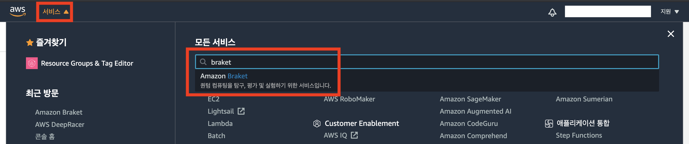
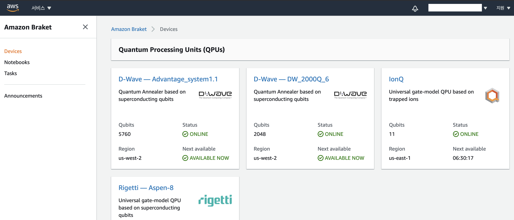
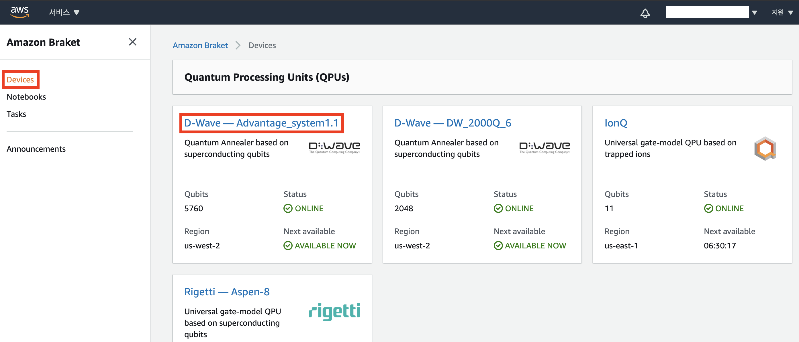
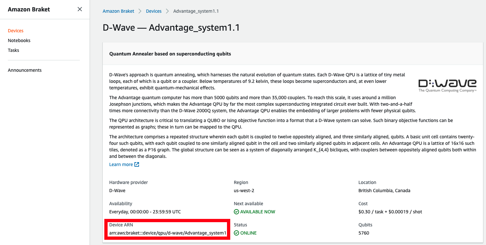

Amazon Braket  콘솔에 접속하여 사용가능한 Devices를 확인합니다.

---
## Amazon Braket 콘솔 접속
1. AWS Management Console에서 [Amazon Braket 서비스](https://us-west-2.console.aws.amazon.com/braket/home?region=us-west-2#/devices)를 검색합니다.

2. 아래와 같은 **Devices** 화면을 보실 수 있습니다.

---
## QPU ARN 확인
1. Amazon Braket 콘솔로 다시 돌아옵니다. **Devices 탭**에서 각 **QPU의 이름**을 클릭하면 상세 설명을 볼 수 있습니다.

2. 상세 설명에서 하드웨어 공급자, 리전, 사용 가능 시간, 비용 등을 볼 수 있습니다. 여기서 **Device ARN 경로**를 이용해 해당 QPU를 사용할 수 있습니다.

---
© 2020 Amazon Web Services, Inc. 또는 자회사, All rights reserved.
