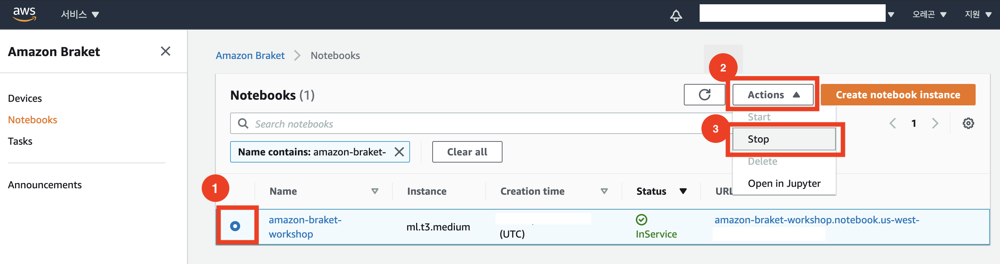
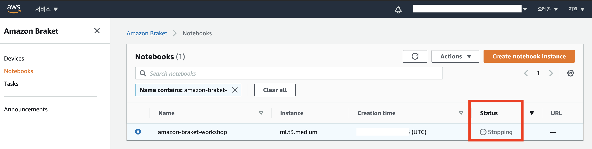
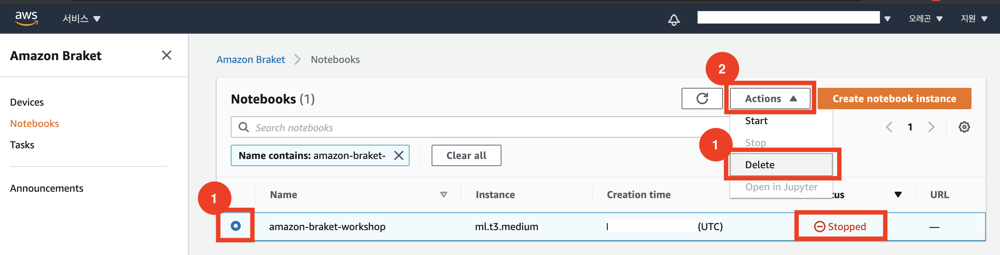
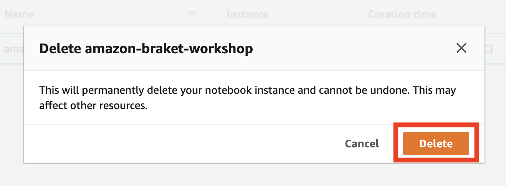

{}
본 실습을 마치면 사용한 AWS 계정에 비용이 추가로 발생하지 않도록 사용한 리소스를 삭제해야 합니다.
{}

---
## Notebook Instance 삭제

1. 실행중인 instance의 라디오 버튼을 클릭한 후, **Actions 버튼**을 누릅니다. 드롭다운 메뉴에 있는 **Stop**을 클릭해 instance를 중지합니다. 

2. Instance의 상태가 **Stopping**에서 **Stopped**로 변경되며, 몇 분이 소요될 수 있습니다. 해당 instance의 라디오 버튼을 클릭한 후, **Actions 버튼**을 누릅니다. 드롭다운 메뉴에 있는 **Delete**을 클릭합니다.

3. 팝업창의 **Delete**를 누르면 instance가 삭제된 것을 확인할 수 있습니다.

---

© 2020 Amazon Web Services, Inc. 또는 자회사, All rights reserved.

