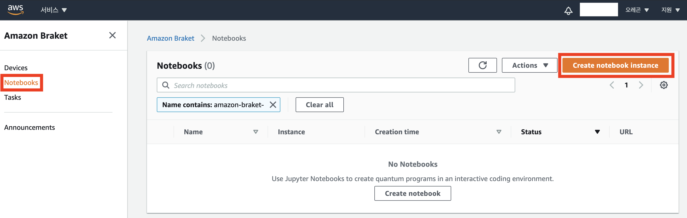
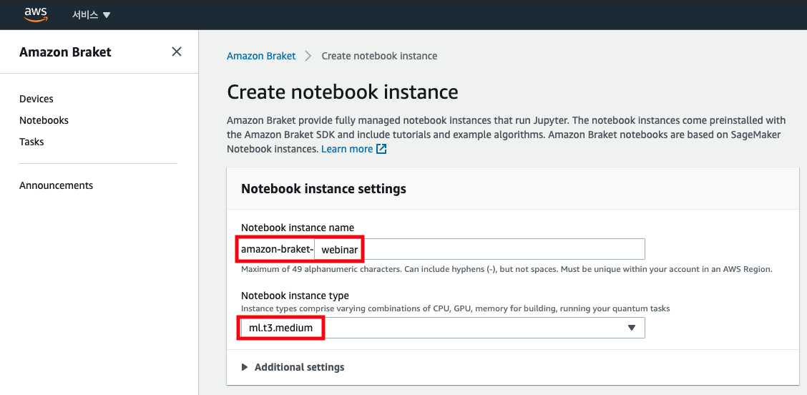
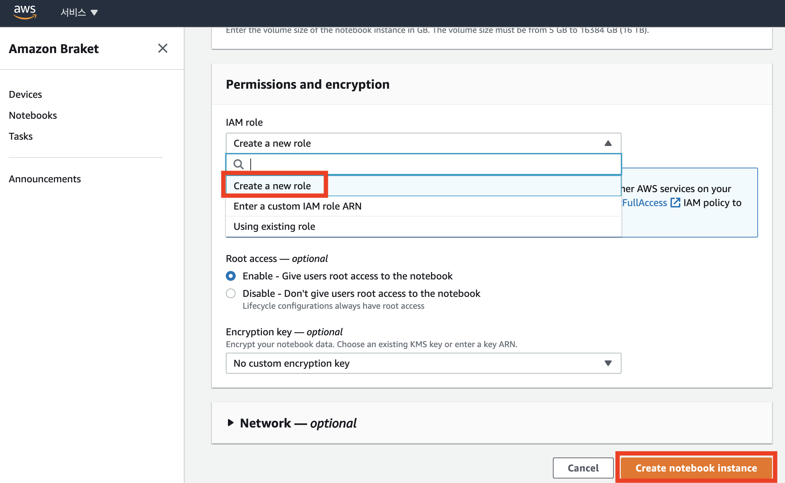
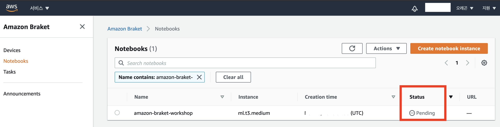
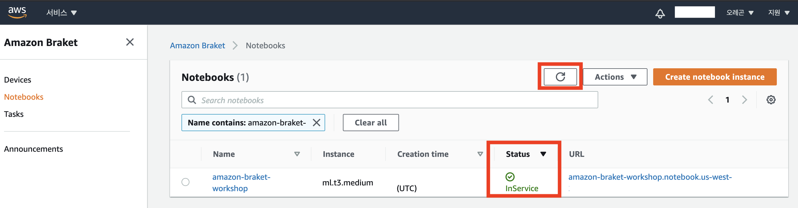
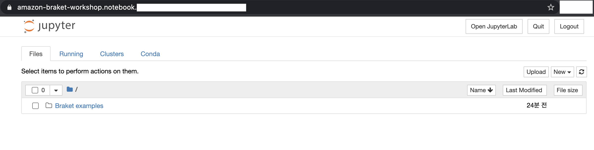
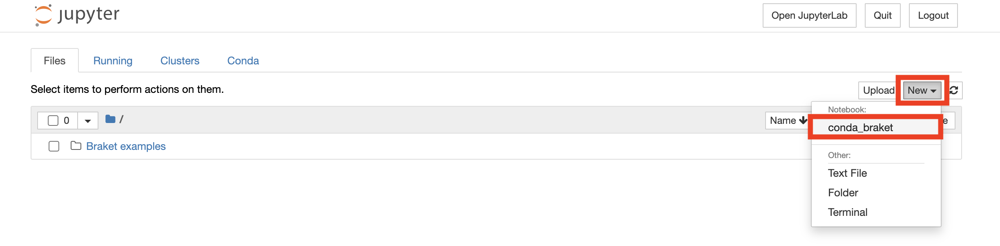
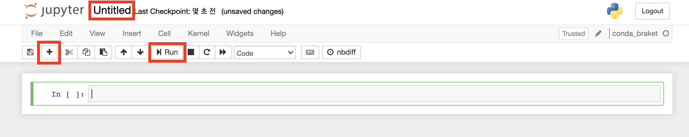

클릭만으로 Amazon Braket을 사용할 수 있는 완전 관리형 Jupyter Notebook을 생성합니다. Notebook instance는 Amazon SageMaker notebook instance를 기반으로 합니다.

---
## Notebook 생성 
1. 좌측의 **Notebooks 탭**을 선택합니다. 그 후, **Create notebook instance 버튼**을 클릭합니다.

2. Notebook instance name 필드에 사용하실 notebook 이름을 입력하세요. 본 실습에서는 `amazon-braket-webinar`으로 입력하여 진행합니다. Notebook instance type은 SageMaker의 notebook instance로, 필요한 타입을 선택하시면 됩니다. 여기서는 default인 **ml.t3.medium**을 선택합니다.

{}
Notebook instance 이름은 영/숫자, 하이픈 문자(/)만 가능합니다.
{}

3. Permissions and encryption에서는 IAM role을 생성합니다. **Create a new role**을 선택하시면 자동으로 **AmazonBraketServiceSageMakerNotebookRole**으로 시작하는 role이 생성되어 추후에는 Using existing role을 클릭해 재사용하실 수 있습니다. **Create notebook instance 버튼**을 클릭합니다.

4. **Create notebook instance 버튼**을 클릭합니다. Notebook을 만드는 데에 몇 분 정도가 소요되며, **Pending** 상태로 notebook 페이지에 표시됩니다.

5. Notebook instance가 사용할 준비가 되면 상태가 **InService**로 변경됩니다. 만약 상태가 변경되지 않으면 새로 고침을 누르셔야 합니다.

6. Name의 **amazon-braket-영문성함**을 클릭하시면, Amazon SageMaker 콘솔로 리다이렉트되어 Jupyter notebook을 사용하실 수 있습니다. 아래와 같이 자동으로 Braket examples 폴더가 생성되어 예제 코드도 보실 수 있습니다.

---
## Jupyter Notebook 실행
1. 우측의 **New 버튼**을 클릭한 후, 드롭다운 메뉴의 **conda_braket**을 선택합니다.

2. 아래와 같은 새 Jupyter notebook이 실행됩니다. **Untitled** 부분을 클릭하면 제목을 변경할 수 있습니다. **+버튼**을 클릭하면 새로운 cell이 삽입되어 코드를 입력할 수 있습니다. 코드를 실행하려면, cell을 클릭한 후 **Run 버튼**을 클릭하거나 **shift + enter 키**를 누르면 됩니다.
 
---

© 2020 Amazon Web Services, Inc. 또는 자회사, All rights reserved.

