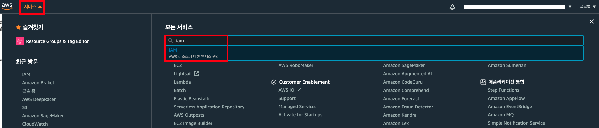

개인 계정(Root 계정)에서 IAM 계정을 생성하실 경우, IAM에 braket 사용을 위한 policy를 추가해야합니다.
현재 **AmazonBraketFullAccess** policy에는 IAM role 생성 권한이 포함되어 있지않습니다. 본 실습에서는 Braket에서 IAM role을 만들 수 있는 새로운 정책을 생성합니다.

---

## IAM Policy 생성
1. AWS Management Console에서 [IAM 서비스](https://console.aws.amazon.com/iam/home)로 접속합니다.


2. 좌측 탭에서 **정책**을 클릭하면 아래와 같은 화면이 나타납니다. **정책 생성 버튼**을 클릭해주세요.


3. **JSON 탭**을 클릭해 JSON 코드를 붙여넣은 후, **정책 검토**를 클릭해주세요.


아래는 JSON 코드입니다.
```
{
    "Version": "2012-10-17",
    "Statement": [
        {
            "Effect": "Allow",
            "Action": [
                "s3:GetObject",
                "s3:PutObject",
                "s3:ListBucket"
            ],
            "Resource": "arn:aws:s3:::amazon-braket-*"
        },
        {
            "Effect": "Allow",
            "Action": [
                "logs:Describe*",
                "logs:Get*",
                "logs:List*",
                "logs:StartQuery",
                "logs:StopQuery",
                "logs:TestMetricFilter",
                "logs:FilterLogEvents"
            ],
            "Resource": "arn:aws:logs:*:*:log-group:/aws/braket:*"
        },
        {
            "Effect": "Allow",
            "Action": [
                "iam:ListRoles",
                "iam:ListRolePolicies",
                "iam:GetRole",
                "iam:GetRolePolicy",
                "iam:ListAttachedRolePolicies"
            ],
            "Resource": "*"
        },
        {
            "Effect": "Allow",
            "Action": [
                "sagemaker:CreatePresignedNotebookInstanceUrl",
                "sagemaker:CreateNotebookInstance",
                "sagemaker:DeleteNotebookInstance",
                "sagemaker:DescribeNotebookInstance",
                "sagemaker:StartNotebookInstance",
                "sagemaker:StopNotebookInstance",
                "sagemaker:UpdateNotebookInstance",
                "sagemaker:ListTags"
            ],
            "Resource": "arn:aws:sagemaker:*:*:notebook-instance/amazon-braket-*"
        },
        {
            "Effect": "Allow",
            "Action": [
                "sagemaker:DescribeNotebookInstanceLifecycleConfig",
                "sagemaker:CreateNotebookInstanceLifecycleConfig",
                "sagemaker:DeleteNotebookInstanceLifecycleConfig",
                "sagemaker:UpdateNotebookInstanceLifecycleConfig"
            ],
            "Resource": "arn:aws:sagemaker:*:*:notebook-instance-lifecycle-config/amazon-braket-*"
        },
        {
            "Effect": "Allow",
            "Action": [
                "sagemaker:ListNotebookInstances",
                "sagemaker:ListNotebookInstanceLifecycleConfigs"
            ],
            "Resource": "*"
        },
        {
            "Effect": "Allow",
            "Action": "braket:*",
            "Resource": "*"
        },
        {
            "Effect": "Allow",
            "Action": "iam:CreateServiceLinkedRole",
            "Resource": "arn:aws:iam::*:role/aws-service-role/braket.amazonaws.com/AWSServiceRoleForAmazonBraket*",
            "Condition": {
                "StringEquals": {
                    "iam:AWSServiceName": "braket.amazonaws.com"
                }
            }
        },
        {
            "Action": [
                "iam:PassRole"
            ],
            "Effect": "Allow",
            "Resource": "arn:aws:iam::*:role/service-role/AmazonBraketServiceSageMakerNotebookRole*",
            "Condition": {
                "StringLike": {
                    "iam:PassedToService": [
                        "sagemaker.amazonaws.com"
                    ]
                }
            }
        },
        {
            "Effect": "Allow",
            "Action": [
                "iam:CreateRole",
                "iam:CreatePolicy",
                "iam:AttachRolePolicy",
                "iam:UpdateRolePolicy"
            ],
            "Resource": [
                "arn:aws:iam::*:role/service-role/AmazonBraketServiceSageMakerNotebookRole-*",
                "arn:aws:iam::*:policy/*"
            ]
        }
    ]
}
```

4. **정책 이름**을 `BraketAccessWithCreateIAMRole`로 작성하고, **정책 생성**을 클릭합니다.


---

## IAM 계정 생성

1. 좌측 탭에서 **사용자**를 선택하고, **사용자 추가 버튼**을 클릭합니다.


2. **사용자 이름**을 입력합니다. AWS 액세스 유형은 원하는대로 선택합니다. **다음: 권한 버튼**을 클릭합니다.


3. **기존 정책 직적 연결**을 클릭한 후, 필터에 아까 생성한 policy의 이름 `BraketAccessWithCreateIAMRole`을 입력합니다. 해당 정책을 선택하고 **다음: 태그**를 클릭합니다.


4. **다음: 검토**를 클릭합니다.


5. 내용을 검토한 후 **사용자 만들기 버튼**을 클릭합니다.


6. 사용자 추가가 완료되면 **닫기 버튼**을 클릭합니다.


7. 생성된 **사용자 이름**을 클릭합니다.


8. 사용자에게 생성한 권한이 연결되어 있는 것을 확인할 수 있습니다.


---
© 2020 Amazon Web Services, Inc. 또는 자회사, All rights reserved.

