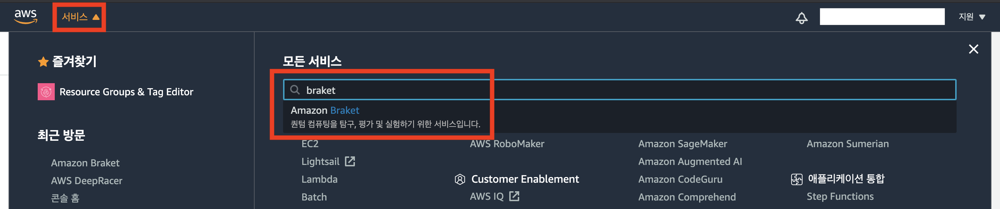
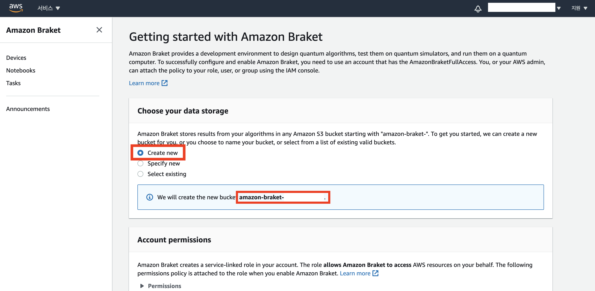
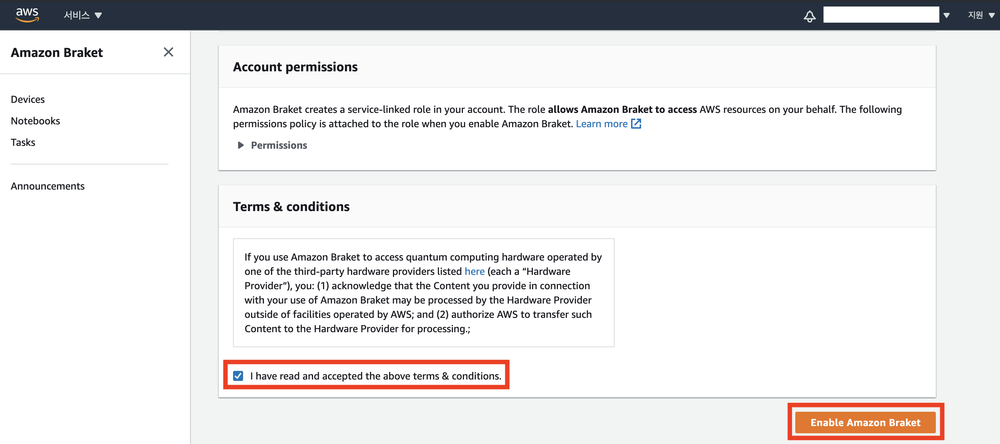
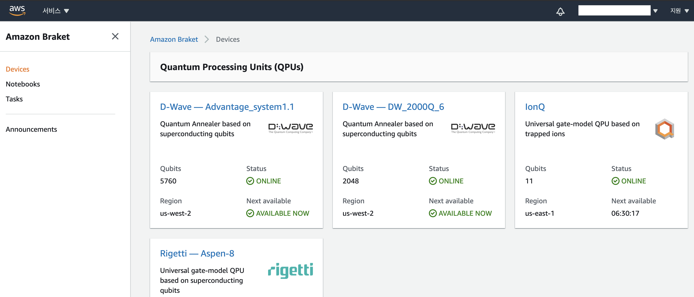

개인 계정(Root 계정)에서 Amazon Braket을 처음  사용하시려면, 콘솔에서 활성화를 해야합니다. 알고리즘 실행 결과를 저장할 수 있는 Storage인 Amazon Simple Storage Service (이하 S3)를 생성합니다.  본 실습은 Braket 콘솔을 통한 S3 bucket 생성 방법을 안내드립니다.

---

## Braket 콘솔에서 S3 bucket 생성 

1. AWS Management Console에서 [Amazon Braket 서비스](https://us-west-2.console.aws.amazon.com/braket/home?region=us-west-2#)로 접속합니다.

2. 처음 접속을 하시면 다음과 같은 화면이 나타납니다. **Create new**를 선택해 자동으로 S3 bucket을 생성합니다. 아래 하늘색 box에 생성되는 생성되는 S3 bucket의 이름이 나타납니다.

{}
Bucket을 생성하는 것만으로 비용이 과금되지 않습니다. Bucket에 Object 저장, 데이터 전송에 대해서만 비용이 과금됩니다.
{}

3. **Terms & conditions**에 동의 체크한 후, **Enable Amazon Braket** 버튼을 클릭합니다.

4. 활성화가 완료되면 **Devices** 화면이 나타납니다.

---

© 2020 Amazon Web Services, Inc. 또는 자회사, All rights reserved.

