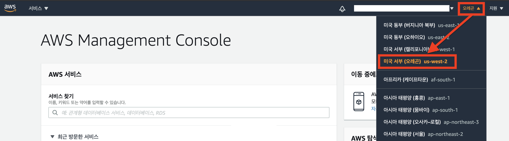
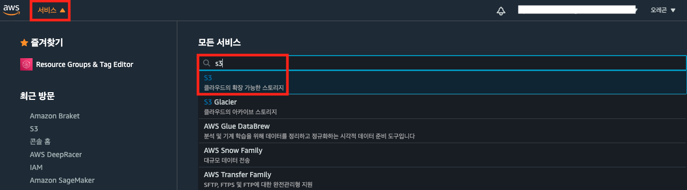
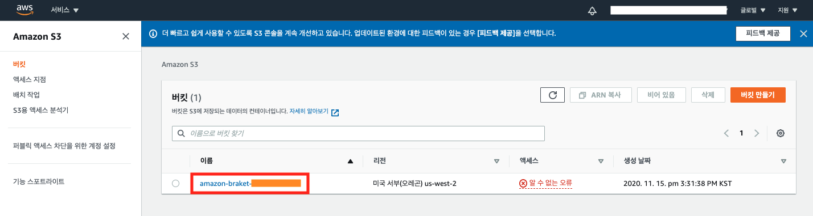

AWS 관리 콘솔에 로그인하여 실습 환경을 준비합니다.

---

## 리전 확인 
원활한 실습을 위해 AWS 콘솔에 접속하여 아래 내용을 확인해주세요.

1. Amazon Braket 서비스 사용을 위해 **미국 서부(오레곤) us-west-2 리전**을 선택하여 진행해주세요.

{}
현재 Simulator는 us-east-1 / us-west-1 / us-west-2 이 3 개의 리전, D-Wave는 us-west-2 리전에서 서비스를 제공하고 있습니다. 그리하여 본 실습은 **미국 서부(오레곤) us-west-2 리전**에서 진행됩니다.   
{} 

2. 실습 문서에 삽입된 이미지는 실습 수행을 돕기 위해 작성되었습니다. 실습을 수행하는 각 요소(IAM, S3 등)의 **식별자ID**는 사용자 계정마다 다를 수 있습니다.
---

## S3 Bucket 주소 확인

{}
Amazon Braket 실행 결과를 S3 bucket에 저장할 수 있습니다.
{}

1. AWS Management Console에서 [Amazon S3 서비스](https://s3.console.aws.amazon.com/s3/home)를 검색합니다.

2. Amazon S3 콘솔에서 아래와 같이 `amazon-braket-xxxx`으로 시작하는 bucket 명을 **메모장에 복사해주세요.** 추후 Jupyter notebook에서 붙여넣기를 합니다.

---

© 2020 Amazon Web Services, Inc. 또는 자회사, All rights reserved.
