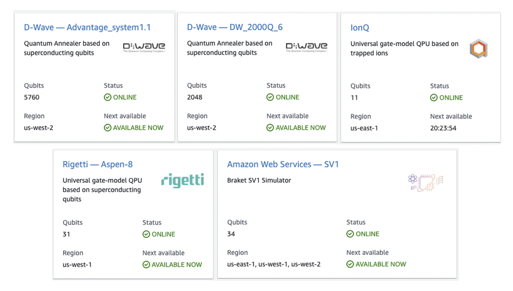

본 실습에서 사용할 QPU Device는 **D-Wave와 Simulator**입니다. 2020.11 기준, Amazon Braket에서 사용할 수 있는 QPU 개수는 총 4개이며 Simulator는 1개 입니다.

**QPU에는** 
- D-Wave - Advantage_system1.1 (Qubits: 5760)
- D-Wave - DW_2000Q_6 (Qubits: 2048)
- IonQ (Qubits: 11)
- Rigetti - Aspen-8 (Qubits: 31)

**Simulator에는**
- Amazon Web Services — SV1 (Qubits: 34)

가 있습니다.

---

© 2020 Amazon Web Services, Inc. 또는 자회사, All rights reserved.

