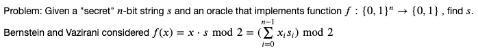
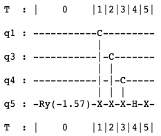
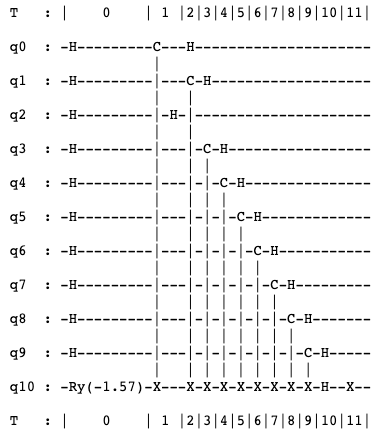
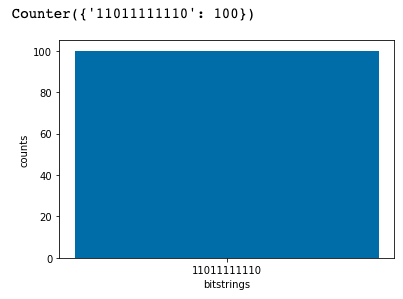
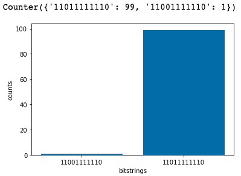
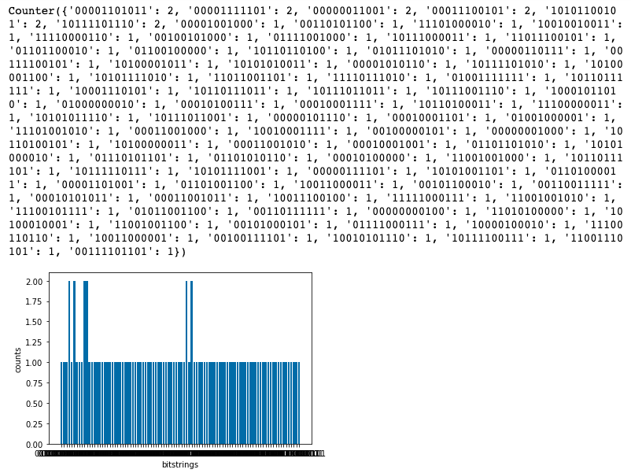

Simulator는 Simulator 실습에서 사용한 **Braket SV1 Simulator**를 사용합니다. 

**IonQ**는 trapped ions 기반 범용 **gate-model 방식**의 QPU Device입니다. 높은 수준의 quantum logic gates를 최소 단위의 laser pulses 세트로 최적화하여 trapped ions에 대한 프로그램을 실현하고, Continuous calibrations으로 실행을 위한 ideal pairs에 gates를 매핑합니다. Single-qubit gates의 경우 GPI gate, GPI2 gate 및 GZ gate를 사용하고, entangling two-qubit gates의 경우 Mølmer-Sørenson gate를 사용합니다.

**Regetti**는 superconducting qubits 기반 범용 **gate-model 방식**의 QPU Device입니다. Aspen-8 chip은 확장 가능한 32-qubit node technology 내에서 alternating fixed-frequency 및 superconducting qubits의 조정 가능한 tileable lattices 가 특징입니다. Aspen chip topology는 3-fold (edge인 경우, 2-fold)로 연결된 8 각형 모양이며 성능을 위해 프로그램을 최적화하고, circuit depth를 최소화 할 수 있는 CZ 및 XY entangling gates를 갖추고 있습니다.

---

## Simulator / IonQ / Rigetti 를 사용한 Bernstein Vazirani Algorithm
본 실습에서는 **Bernstein Vazirani Algorithm**을 다룹니다. 함수 두개의 서로 다른 클래스 사이를 구별하는 대신에, 함수에 인코딩된 문자열을 학습합니다. Complexity classes BQP와 BPP간의 oracle separation을 증명합니다.


--- 
## 실습 코드
이제부터 **Jupyter notebook의 각 cell**에 아래 코드를 붙여 넣은 후, **Run 버튼**을 클릭하거나 **shift + enter 키**를 눌러 실행하시면 됩니다.

{}
IonQ와 Rigetti는 양자컴퓨팅 교육 세미나 시간에 사용이 가능하지 않아, SV1 코드만 포함되어 있습니다. 또한, 새로운 Jupyter notebook을 생성해서 진행해주세요.
{}

1. Import로 모듈 가져오기
```
import boto3
import numpy as np
import math

import matplotlib.pyplot as plt
%matplotlib inline

import string
import time
from datetime import datetime
import logging

# AWS imports: Import Braket SDK modules
from braket.circuits import Circuit, Gate, Instruction, circuit, Observable
from braket.aws import AwsDevice, AwsQuantumTask
from braket.devices import LocalSimulator
```

2. 결과를 저장할 S3 bucket을 지정합니다. **my_bucket**에는 복사한 S3 bucket의 주소 `amazon-braket-xxxx`로 변경하시고, **my_prefix**는 그대로 복사해주세요.
```
my_bucket = f"amazon-braket-xxxx"
my_prefix = "compare-output"
s3_folder = (my_bucket, my_prefix)
```

3. _U_ 함수에 대한 quantum oracle circuit을 정의합니다.
```
def oracleBV(s):
    ## s is the "secret" string
    nQbts = len(s) + 1
    
    ## initilize the oracle ancila in |->
    oracle_circ = Circuit().ry(nQbts-1,-0.5*np.pi)
    
    ## add a Cx gate between qubit i and ancilla if s_i = 1 
    for ind in range(nQbts-1):
        if s[ind] == '1':
            oracle_circ.cnot(control=ind, target=nQbts-1)
    ## rotate the ancilla qubit back to the Z basis and flip it        
    oracle_circ.h(nQbts-1).x(nQbts-1)
    return oracle_circ
```

```
s = '01011'
print (oracleBV(s))
```

아래와 같이 circuit을 확인할 수 있습니다.


4. Bernstein Vazirani Circuit을 구현합니다.
```
## define the secret string
s = '1101111111'
## Initialize the BV circuit
BV_circuit = Circuit()

for ind in range(len(s)):
    BV_circuit.h(ind)

## Add the oracle to the circuit
BV_circuit.add_circuit(oracleBV(s))

## Rotate back to the computational basis
for ind in range(len(s)):
    BV_circuit.h(ind)

## Print the BV circuit
print(BV_circuit)
```

아래와 같이 circuit을 확인할 수 있습니다.



### Simulator SV1
5. 사용할 Device를 설정하는 부분입니다. 아래와 동일하게 **Simulator SV1의 ARN 주소**를 입력합니다.
```
device = AwsDevice("arn:aws:braket:::device/quantum-simulator/amazon/sv1")
print('Device:', device)
```

6. Simulator SV1에서 Bernstein Vazirani Circuit을 실행합니다.
```
## Create a quantum task to run the BV circuit
task_BV = device.run(BV_circuit, s3_folder, shots=100)

## Get results of task
results = task_BV.result()

## Get measurement counts
counts = results.measurement_counts

# print counts
print(counts)

# plot using Counter
plt.bar(counts.keys(), counts.values());
plt.xlabel('bitstrings');
plt.ylabel('counts');
```

아래와 같이 결과를 볼 수 있습니다.


{}
IonQ와 Rigetti는 양자컴퓨팅 교육 세미나 시간에 사용이 가능하지 않아, SV1 코드만 포함되어 있습니다. 전체적인 코드 내용은 동일하며 결과만 포함하였습니다. 코드를 원하시면, 세미나 이후 해당 가이드에 업로드 될 예정이니 참고 부탁드립니다.
{}

### IonQ
아래와 같이 결과를 볼 수 있습니다.



### Rigetti
아래와 같이 결과를 볼 수 있습니다.


---

© 2020 Amazon Web Services, Inc. 또는 자회사, All rights reserved.
