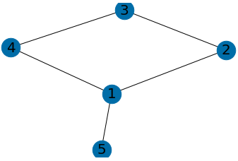
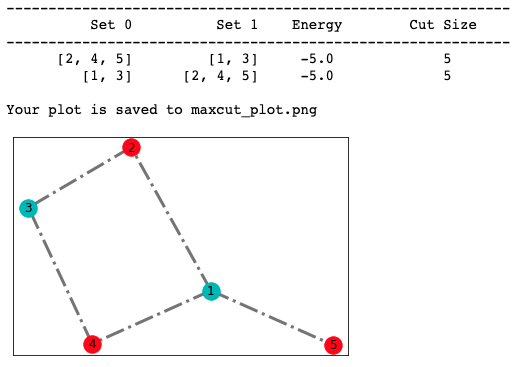

D-Wave는 초전도 qubit 기반 **quantum annealing 방식**을 사용하는 QPU Device입니다. 각 D-Wave QPU는 qubit나 coupler라는 작은 금속 loops의 lattice로 이루어져 있습니다. 9.2 Kelvin 이하의 온도에서는 이와 같은 loops가 초전도체가 되고 더 낮은 온도에서는 quantum-mechanical 효과가 발생합니다. D-Wave 2000Q QPU에는 2000 qubits와 6000 couplers가 있고, 이 규모에 도달하기 위해 128,000 개의 Josephson junctions를 사용합니다. 

---

## D-Wave를 사용한 MaxCut Problem
본 실습에서는 **Maximum cut problem**을 다룹니다. MaxCut 문제는 조합 최적화에서 가장 유명한 NP-complete 문제 중 하나입니다. Vertex set _V_ 및 edge set _E_ 와 함께 undirected graph _G(V, E)_ 가 주어지면, MaxCut problem은 두 세트 사이의 edge의 수가 최대가 되도록 분할합니다. MaxCut problem은 마케팅 목적의 클러스터링 문제 또는 재무의 포트폴리오 최적화 문제에서 응용할 수 있습니다.

---

## 실습 코드
이제부터 **Jupyter notebook의 각 cell**에 아래 코드를 붙여 넣은 후, **Run 버튼**을 클릭하거나 **shift + enter 키**를 눌러 실행하시면 됩니다.

1. Import로 모듈 가져오기
```
import boto3
import numpy as np
import json
from braket.aws import AwsDevice
from braket.ocean_plugin import BraketSampler, BraketDWaveSampler

import networkx as nx
import dwave_networkx as dnx
from dimod.binary_quadratic_model import BinaryQuadraticModel
from dwave.system.composites import EmbeddingComposite
from collections import defaultdict

import matplotlib.pyplot as plt
%matplotlib inline
```

2. 결과를 저장할 S3 bucket을 지정합니다. **my_bucket**에는 복사한 S3 bucket의 주소 `amazon-braket-xxxx`로 변경하시고, **my_prefix**에는 그대로 복사해주세요.
```
my_bucket = f"amazon-braket-xxxx"
my_prefix = "dwave-output"
s3_folder = (my_bucket, my_prefix)
``` 

3. 사용할 Device를 설정하는 부분입니다. 아래와 동일하게 **D-Wave의 ARN 주소**를 입력합니다.
```
device = AwsDevice("arn:aws:braket:::device/qpu/d-wave/DW_2000Q_6")
print('Device:', device)
```

4. Solution에 대한 그래프를 제공하는 함수입니다.
```
def get_graph(graph, pos):
    # nodes
    nx.draw_networkx_nodes(graph, pos, node_size=700)

    # edges
    nx.draw_networkx_edges(graph, pos)

    # labels
    nx.draw_networkx_labels(graph, pos, font_size=20, font_family='sans-serif')

    # plot the graph
    plt.axis('off')
    plt.show();
```

5. D-Wave에 사용할 그래프를 설정합니다.
```
# Create empty graph
G = nx.Graph()

# Add edges to the graph (also adds nodes)
G.add_edges_from([(1,2),(1,4),(1,5),(2,3),(3,4)])

# plot graph
pos = nx.spring_layout(G)
# plot graph with labels
get_graph(G, pos)

# ------- Set up our QUBO dictionary -------
# Initialize our Q matrix
Q = defaultdict(int)

# Update Q matrix for every edge in the graph
for u, v in G.edges:
    Q[(u,u)]+= -1
    Q[(v,v)]+= -1
    Q[(u,v)]+= 2
```

아래와 같이 설정한 그래프를 이미지로 볼 수 있습니다.


6. 위에서 설정한 QUBO를 D-Wave에서 실행해 MaxCut Problem의 결과를 도출합니다. 
```
# Set up DWave parameters
chainstrength = 8
numruns = 100

# Run the QUBO on the Braket solver from your config file
# set sampler
sampler = BraketDWaveSampler(s3_folder,'arn:aws:braket:::device/qpu/d-wave/DW_2000Q_6')
sampler = EmbeddingComposite(sampler)
response = sampler.sample_qubo(Q, chain_strength=chainstrength, num_reads=numruns)
energies = iter(response.data())

# ------- Print results to user -------
print('-' * 60)
print('{:>15s}{:>15s}{:^15s}{:^15s}'.format('Set 0','Set 1','Energy','Cut Size'))
print('-' * 60)
for line in response:
    S0 = [k for k,v in line.items() if v == 0]
    S1 = [k for k,v in line.items() if v == 1]
    E = next(energies).energy
    print('{:>15s}{:>15s}{:^15s}{:^15s}'.format(str(S0),str(S1),str(E),str(int(-1*E))))

# ------- Display results to user -------
# Grab best result
# Note: "best" result is the result with the lowest energy
# Note2: the look up table (lut) is a dictionary, where the key is the node index
#   and the value is the set label. For example, lut[5] = 1, indicates that
#   node 5 is in set 1 (S1).
lut = response.lowest().first.sample

# Interpret best result in terms of nodes and edges
S0 = [node for node in G.nodes if not lut[node]]
S1 = [node for node in G.nodes if lut[node]]
cut_edges = [(u, v) for u, v in G.edges if lut[u]!=lut[v]]
uncut_edges = [(u, v) for u, v in G.edges if lut[u]==lut[v]]

# Display best result
pos = nx.spring_layout(G)
nx.draw_networkx_nodes(G, pos, nodelist=S0, node_color='r')
nx.draw_networkx_nodes(G, pos, nodelist=S1, node_color='c')
nx.draw_networkx_edges(G, pos, edgelist=cut_edges, style='dashdot', alpha=0.5, width=3)
nx.draw_networkx_edges(G, pos, edgelist=uncut_edges, style='solid', width=3)
nx.draw_networkx_labels(G, pos)

filename = "maxcut_plot.png"
plt.savefig(filename, bbox_inches='tight')
print("\nYour plot is saved to {}".format(filename))
```

아래와 같이 MaxCut Problem의 결과를 볼 수 있습니다.



