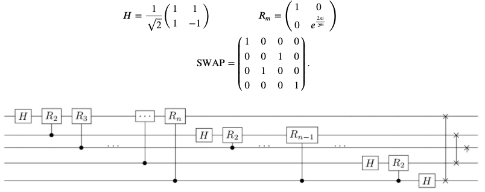
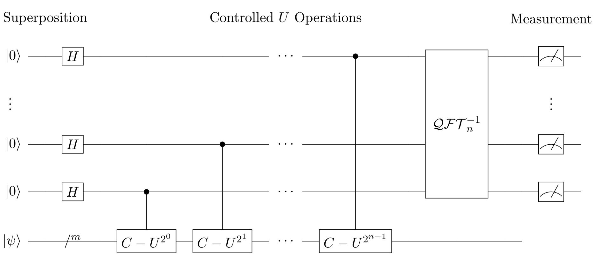
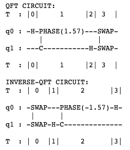
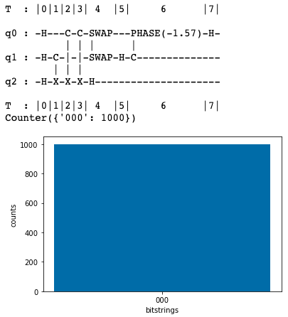

Simulator는 Braket SV1 Simulator를 사용합니다. SV1는 Amazon EC2 cluster에서 실행되는 완전 관리형(fully-managed) 고성능 **state vector simulator**입니다. SV1을 사용하여 최대 34 qubits의 회로를 시뮬레이션 할 수 있습니다. SV1은 항상 사용할 수 있으며 필요에 따라 회로를 실행해 여러 circuits을 병렬로 실행할 수 있습니다. 

---
## Simulator를 사용한 QFT와 QPE
본 실습에서는 QFT (Quantum Fourier Transformation)와 QPE (Quantum Phase Estimation) 알고리즘을 다룹니다. 

**QFT (Quantum Fourier Transformation) 알고리즘**은 다양한 양자 알고리즘의 일부분으로, discrete logarithms를 인수 분해하는 Shor’s 알고리즘, unitary operator의 eigenvalues을 추정하는 QPE 알고리즘, hidden subgroup problem에 사용됩니다. QFT circuit은 Hadamard gate _H_ , controlled phase gate _R_ , 그리고 SWAP gate로 구현할 수 있습니다.


**QPE (Quantum Phase Estimation) 알고리즘**은 unitary matrix 및 양자 상태가 주어지면 알고리즘이 qubits를 사용하여 오차 내에서 높은 확률로 값을 추정하고 제어합니다. QPE circuit은 Hadamard gate, controlled- _U_ unitaries, 그리고 inverse QFT로 구성되어 있습니다. 여기서 _m_ 은 lower query register의 크기이고, _n_ 은 upper precision register의 크기입니다. 


--- 
## 실습 코드
이제부터 **Jupyter notebook의 각 cell**에 아래 코드를 붙여 넣은 후, **Run 버튼**을 클릭하거나 **shift + enter 키**를 눌러 실행하시면 됩니다.

{}
새로운 Jupyter notebook을 생성해서 진행해주세요.
{}

1. Import로 모듈 가져오기
```
import boto3
import numpy as np
import math

import matplotlib.pyplot as plt
%matplotlib inline

import string
import time
from datetime import datetime
import logging

# AWS imports: Import Braket SDK modules
from braket.circuits import Circuit, Gate, Instruction, circuit, Observable
from braket.aws import AwsDevice, AwsQuantumTask
```

2. 결과를 저장할 S3 bucket을 지정합니다. **my_bucket**에는 복사한 S3 bucket의 주소 `amazon-braket-xxxx`로 변경하시고, **my_prefix**는 그대로 복사해주세요.
```
my_bucket = f"amazon-braket-xxxx"
my_prefix = "simulator-output"
s3_folder = (my_bucket, my_prefix)
```

3. 사용할 Device를 설정하는 부분입니다. 아래와 동일하게 **Simulator SV1의 ARN 주소**를 입력합니다.
```
device = AwsDevice("arn:aws:braket:::device/quantum-simulator/amazon/sv1")
print('Device:', device)
```

4. **QFT 알고리즘**와 **Inverse QFT 알고리즘**을 구현한 함수입니다.
```
## QFT function
def qft(qubits):
    qftcirc = Circuit()
    
    # get number of qubits
    num_qubits = len(qubits)
    
    for k in range(num_qubits):
        # First add a Hadamard gate
        qftcirc.h(qubits[k])
    
        # Then apply the controlled rotations, with weights (angles) defined by the distance to the control qubit.
        # Start on the qubit after qubit k, and iterate until the end.  When num_qubits==1, this loop does not run.
        for j in range(1,num_qubits - k):
            angle = 2*math.pi/(2**(j+1))
            qftcirc.cphaseshift(qubits[k+j],qubits[k], angle)
            
    # Then add SWAP gates to reverse the order of the qubits:
    for i in range(math.floor(num_qubits/2)):
        qftcirc.swap(qubits[i], qubits[-i-1])
        
    return qftcirc

## Inverse QFT function
def inverse_qft(qubits):
    # instantiate circuit object
    qftcirc = Circuit()
    
    # get number of qubits
    num_qubits = len(qubits)
    
    # First add SWAP gates to reverse the order of the qubits:
    for i in range(math.floor(num_qubits/2)):
        qftcirc.swap(qubits[i], qubits[-i-1])
        
    # Start on the last qubit and work to the first.
    for k in reversed(range(num_qubits)):
    
        # Apply the controlled rotations, with weights (angles) defined by the distance to the control qubit.
        # These angles are the negative of the angle used in the QFT.
        # Start on the last qubit and iterate until the qubit after k.  
        # When num_qubits==1, this loop does not run.
        for j in reversed(range(1, num_qubits - k)):
            angle = -2*math.pi/(2**(j+1))
            qftcirc.cphaseshift(qubits[k+j],qubits[k], angle)
            
        # Then add a Hadamard gate
        qftcirc.h(qubits[k])
    
    return qftcirc
```

5. QFT circuits의 예시를 보여줍니다.
```
# show inverse QFT example circuit
num_qubits = 2
qubits=range(num_qubits)
my_qft_circ = qft(qubits)
print('QFT CIRCUIT:')
print(my_qft_circ)

# show inverse QFT example circuit
print('')
print('INVERSE-QFT CIRCUIT:')
my_iqft_circ = inverse_qft(qubits)
print(my_iqft_circ)
```
아래와 같이 circuit을 확인할 수 있습니다.



6. 이제부터는 QPE에 대한 예시입니다. 제어된 단일 circuit을 함수로 정의합니다.
```
def cU(cInd, tInd):
    return Circuit().cnot(cInd,tInd)

def str2circ(s, indQ0):
    circ = Circuit()
    for ind in range(len(s)):
        if s[ind]=='1':
            circ.x(ind+indQ0)
    return circ
```

7. Two-qubit query register와 함께 QPE를 사용해 **Pauli _X_ 연산자의 eigenstates**를 판단합니다.
```
# QPE circuit for |+> eigenstate of X
circ_QPE = Circuit().h(0).h(1).h(2)
circ_QPE = circ_QPE.add_circuit(cU(1,2))
circ_QPE = circ_QPE.add_circuit(cU(0,2))
circ_QPE = circ_QPE.add_circuit(cU(0,2))
circ_QPE = circ_QPE.add_circuit(inverse_qft([0,1]))
circ_QPE = circ_QPE.add_circuit(Circuit().h(2))

print (circ_QPE)

task = device.run(circ_QPE, s3_folder, shots=1000)
result = task.result()

## Get measurement counts
counts = result.measurement_counts

# print counts
print(counts)

# plot using Counter
plt.bar(counts.keys(), counts.values());
plt.xlabel('bitstrings');
plt.ylabel('counts');
```
아래와 같이 QPE circuit과 결과를 확인할 수 있습니다.


---

© 2020 Amazon Web Services, Inc. 또는 자회사, All rights reserved.
