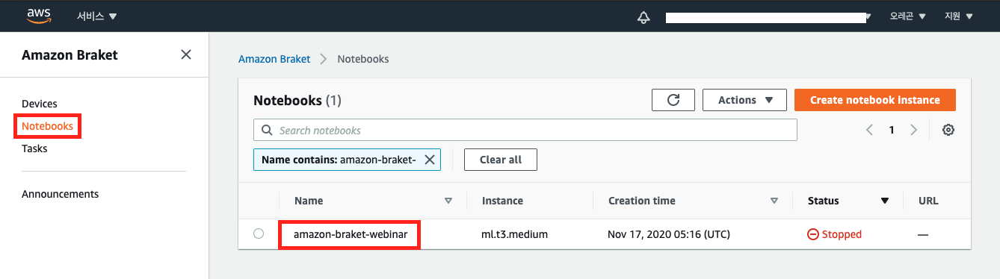
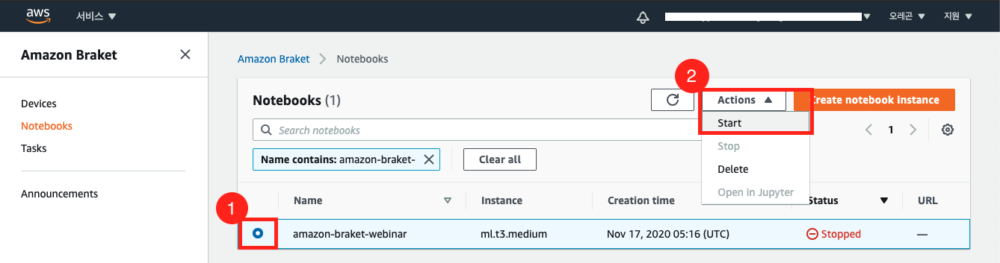
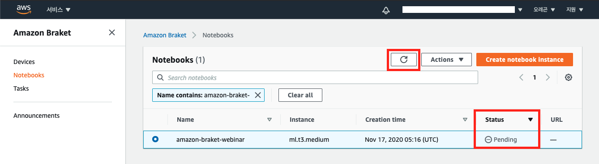
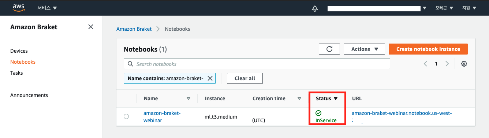
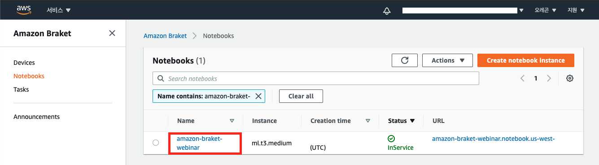
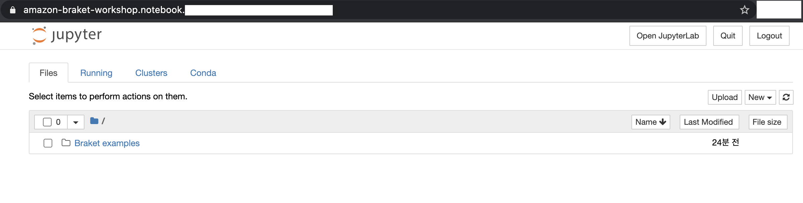
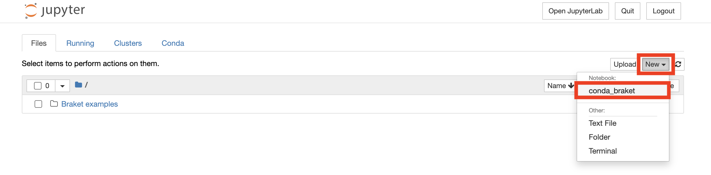
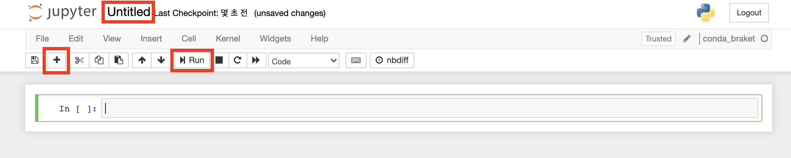

클릭만으로 Amazon Braket을 사용할 수 있는 완전 관리형 Jupyter Notebook을 실행합니다. Notebook instance는 Amazon SageMaker notebook instance를 기반으로 합니다.

---
## Notebook Instance 실행
1. 좌측의 **Notebooks 탭**을 선택합니다. Notebooks 목록에 `amazon-braket-webinar` 라는 notebook instance를 볼 수 있습니다. 

2. 현재 instance는 중지된 상태입니다. `amazon-braket-webinar`  instance의 라디오 버튼을 클릭한 후, **Actions 버튼**을 누릅니다. 드롭다운 메뉴에 있는 **Start**를 클릭해 instance를 시작합니다.

3. Notebook instance의 상태가 **Pending** 으로 변경되며 실행되기 전까지 몇 분이 소요될 수 있습니다. 상태가 **InService**가 되지 않는다면 Action 옆에 있는 **새로 고침 버튼**을 클릭하세요.

4. 아래와 같이 **InService**로 상태가 변경되면 성공적으로 notebook을 사용할 수 있습니다.

5. Name의 **amazon-braket-webinar**를 클릭합니다.

6. Amazon SageMaker 콘솔로 리다이렉트되어 Jupyter notebook을 사용하실 수 있습니다. Braket examples 폴더에 있는 예제 코드도 볼 수 있습니다.

---
## 새 Jupyter Notebook 실행
1. 우측의 **New 버튼**을 클릭한 후, 드롭다운 메뉴의 **conda_braket**을 선택합니다.

2. 아래와 같은 새 Jupyter notebook이 실행됩니다. **Untitled** 부분을 클릭하면 제목을 변경할 수 있습니다. **+버튼**을 클릭하면 새로운 cell이 삽입되어 코드를 입력할 수 있습니다. 코드를 실행하려면, cell을 클릭한 후 **Run 버튼**을 클릭하거나 **shift + enter 키**를 누르면 됩니다.
 
---

© 2020 Amazon Web Services, Inc. 또는 자회사, All rights reserved.

